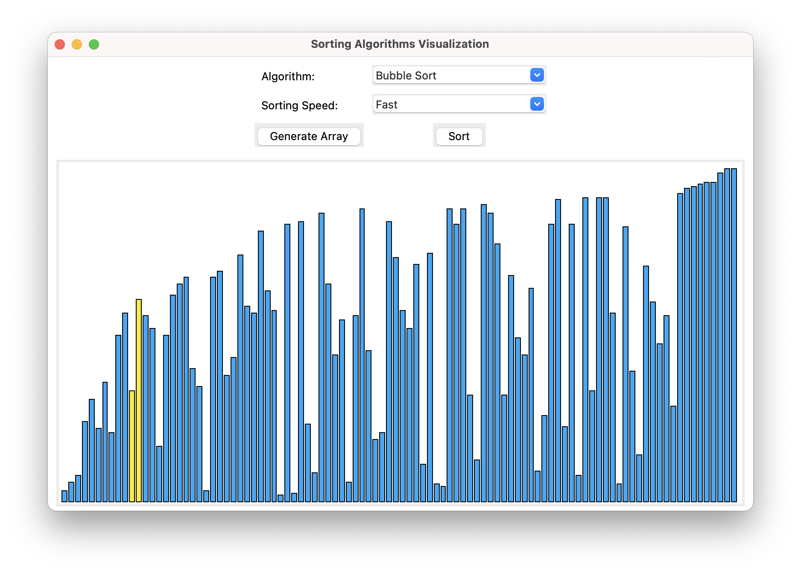

# Sorting Algorithms Visualizer
<p>A python application to visualize various sorting algorithms.</p>

<p align='center'></p>

## Implemented Algorithms:
* Bubble Sort 
* Insertion Sort 
* Selection Sort 
* Merge Sort 
* Quick Sort 
* Heap Sort 

## Built With:
* Python 3.8
* Tkinter 8.6

<!-- ## Screenshots: -->
<!-- <p align="center"></p>
<p align="center"></p>
<p align="center"></p> -->

## Run It (Python >= 3.8):
- Clone the repository
```bash
$ git clone https://github.com/agraj23/sorting-algo-visualiser.git
```
- Run ```main.py``` from root
```bash
$ python3 main.py 
```
